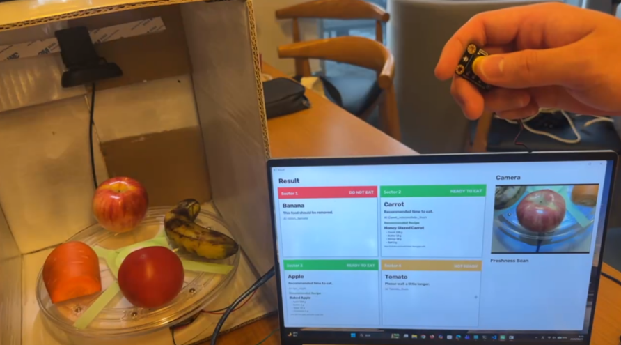
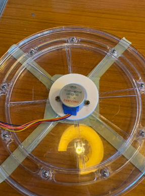

# SP!ED 2026 - AI Food Freshness Priority Scanner

**English** | [日本語](README_ja.md)

<p>
  
  
  
  
</p>

A **smart refrigerator prototype that recognizes food items with AI and presents the food that should be checked next**.

This project was developed as part of an international team project at **[SP!ED 2026](https://ire-asia.org/ire/spied/)**.  
During the program, we developed a system that combines AI-based food condition recognition with a rotary shelf, allowing the system to move the section that should be checked toward the user according to the detected food condition.

I was mainly responsible for the **implementation and validation of the AI-based food condition recognition component**.

This repository provides a **PC-oriented portfolio version** that combines manual 4-slot scanning with Priority Logic so that the core AI workflow can be tested without Arduino, motors, or the physical rotary shelf.

<p align="center">
  
</p>

---

## 📖 Project Overview

After food is placed in a refrigerator, items stored farther toward the back can become difficult to see and may eventually be forgotten.

This is particularly relevant for fresh foods such as fruits and vegetables, whose condition cannot always be determined only from an expiration date or barcode.  
Because their condition often needs to be checked visually, food stored in the back of the refrigerator can follow a pattern such as:

```text
Stored
  ↓
Hidden
  ↓
Forgotten
  ↓
Loss of freshness / Food waste
```

To address this issue, this project was designed around the idea:

**"Instead of making the user search for food, the system presents the food that should be checked."**

We developed a smart refrigerator storage system that combines an AI camera with a rotary shelf.

---

## 💡 Problem We Wanted to Solve

A conventional refrigerator can store food, but it does not tell the user **which item should be checked first**.

The back of a refrigerator in particular can become a "hidden area" where:

- food is difficult to see,
- users may forget what they stored,
- users need to reach into the back repeatedly,
- changes in food condition can be overlooked.

To address this, we designed the following workflow:

```text
Camera
  ↓
AI Recognition
  ↓
Priority Decision
  ↓
Physical Action
  ↓
Present the target slot to the user
```

The goal of the project was not simply to classify food with AI, but to **connect recognition results to real-world physical actions**.

---

## 🏗️ System Architecture

The original system developed for SP!ED 2026 combines AI and hardware.

```text
Camera
  │
  └─ Capture each slot
        ↓
AI Model
  │
  └─ Recognize food type and condition
        ↓
Priority Decision
  │
  └─ Determine which slot should be checked
        ↓
Arduino
  │
  └─ Control the stepper motor
        ↓
Rotary Shelf
  │
  └─ Rotate the target slot toward the user
```

<p align="center">
  
</p>

---

## 🎛️ Two Modes in the Original Prototype

### 1 PUSH - Freshness Scan

When the button is pressed once, the system captures each slot in sequence and the AI recognizes the food type and condition.

Based on the recognition results, the system calculates priority and selects the **slot containing the food that should be checked first**.

The Arduino then controls the stepper motor and rotates the target slot toward the user.

```text
Scan
  ↓
Food / Condition Recognition
  ↓
Priority Decision
  ↓
Target Slot
  ↓
Rotation
```

### 2 PUSH - Empty Slot Mode

When the button is pressed twice, the system switches to a mode that **moves an empty slot toward the user so that new food can be stored**.

For this prototype, we did not use a model trained with a dedicated `Empty` class.

During testing with the physical prototype, we observed that when the camera captured a background or an out-of-scope object instead of one of the target fruits or vegetables, the model tended to classify the image as **`Rotten Cucumber`**.

Based on this behavior, we introduced the following constraints:

- **Cucumbers are not used** in the physical slots.
- A slot classified as `Rotten Cucumber` is treated as a **candidate Empty Slot**.

```text
Camera
  ↓
Food Classification Model
  ↓
Rotten Cucumber
  ↓
Treat as Empty Slot
  ↓
Rotate the target slot toward the user
```

This is a **heuristic implementation** that takes advantage of the behavior of the existing model during rapid prototype development.

It is not a general-purpose Empty Slot Detection method. It is a **prototype-specific approach based on the assumption that cucumbers are not used in the actual slots**.

---

## 💻 GitHub Portfolio Version

This GitHub repository allows the AI portion of the project to be tested without Arduino, motors, or other hardware.

The physical prototype's "slot switching by rotating the shelf" has been replaced with **manual scanning using the ENTER key**.

```text
Webcam
  ↓
Scan Slot 1
  ↓
Scan Slot 2
  ↓
Scan Slot 3
  ↓
Scan Slot 4
  ↓
Priority Decision
  ↓
CHECK FIRST
```

After the four slots are registered in sequence, the application displays which slot should be checked first based on the AI recognition results.

The GitHub version focuses on the original prototype's **1 PUSH - Freshness Scan / Priority Decision** workflow.  
The Empty Slot Mode and physical rotation control are not implemented in this repository.

---

## 🎬 Demonstration

This is a demonstration of the physical prototype developed during SP!ED 2026.

<p align="center">
  
</p>

The GIF shows part of the physical prototype operation, including both **Freshness Scan and Empty Slot Mode**.

**[▶ Watch the full demonstration video](assets/demo-video.mp4)**

The full video mainly demonstrates food condition recognition, Priority Decision, and the physical movement of the rotary shelf.  
Note: the full video does **not** include the `2 PUSH - Empty Slot Mode` operation.

---

## 🔍 4-Slot Priority Scanner

In the GitHub version, four virtual slots are scanned one by one.

### Workflow

1. Show a food item to the webcam.
2. Press **ENTER** to scan Slot 1.
3. AI inference is performed on multiple frames for 3 seconds.
4. The final result for Slot 1 is determined by Majority Vote.
5. Repeat the same process for Slot 2, Slot 3, and Slot 4.
6. Once all four slots are registered, the Priority Logic is executed.
7. The slot that should be checked first is displayed as **CHECK FIRST**.
8. Press **ENTER** on the result screen to reset the session.
9. Press **ENTER** again to restart scanning from Slot 1.

Press **Q** or **ESC** to exit.

---

## 🧠 AI-Based Food Condition Recognition

For image classification, this project uses a pretrained ViT-based model published on Hugging Face.

**[Dhahlan2000/freshness_detector_updated](https://huggingface.co/Dhahlan2000/freshness_detector_updated)**

The model performs **30-class classification** for 10 food types, including their condition.

### Supported Foods

| Food | Condition |
| --- | --- |
| Bell Pepper | Fresh / Intermediate Fresh / Rotten |
| Carrot | Fresh / Intermediate Fresh / Rotten |
| Cucumber | Fresh / Intermediate Fresh / Rotten |
| Potato | Fresh / Intermediate Fresh / Rotten |
| Tomato | Fresh / Intermediate Fresh / Rotten |
| Apple | Unripe / Ripe / Rotten |
| Banana | Unripe / Ripe / Rotten |
| Mango | Unripe / Ripe / Rotten |
| Orange | Unripe / Ripe / Rotten |
| Strawberry | Unripe / Ripe / Rotten |

The model is downloaded automatically from Hugging Face on the first run.

The model files are stored under:

```text
models/freshness_detector_updated/
```

and are excluded from Git tracking.

---

## ⚖️ Priority Logic

To compare food conditions, the model output labels are converted into three Priority Groups.

```text
ROTTEN
  ↓
RIPE
  ↓
FRESH
```

The priority order is:

```text
ROTTEN > RIPE > FRESH
```

| Model Label | Priority Group |
| --- | --- |
| `rotten` | `ROTTEN` |
| `ripe` | `RIPE` |
| `intermediate_fresh` | `RIPE` |
| `fresh` | `FRESH` |
| `unripe` | `FRESH` |

Among the four slots, the one with the highest priority is displayed as **CHECK FIRST**.

If multiple slots have the same priority, the lower slot number is selected to keep the result deterministic.

The classification Confidence score is not used for priority comparison because it does not represent the "degree of spoilage."

---

## 🔁 Stable Recognition

Using only a single webcam frame can make predictions sensitive to factors such as:

- camera shake,
- autofocus,
- lighting,
- food orientation,
- temporary misclassification.

To improve stability, the GitHub version performs inference on multiple frames during each scan and determines the final slot result using Majority Vote.

```text
Frame 1 ─┐
Frame 2 ─┤
Frame 3 ─┤
   ...   ├─→ Majority Vote → Slot Result
Frame N ─┘
```

Only when the vote count is tied is the average Confidence of each candidate used as a tiebreaker.

---

## ✨ Main Features

### 📷 Webcam Scan

Captures food in real time using a PC webcam.

- Register four slots sequentially
- Start scanning with the ENTER key
- Real-time AI inference

### 🧠 Food Condition Classification

Classifies both food type and condition using ViT.

- 10 food types
- 30-class classification
- Automatic CPU / GPU selection

### 🔁 Repeated Recognition

Performs multiple inference runs for 3 seconds per slot.

- Multi-frame inference
- Majority Vote
- Average Confidence used only for tied votes

### ⚖️ Priority Decision

Compares the four slots and determines which food should be checked first.

- `ROTTEN > RIPE > FRESH`
- CHECK FIRST display
- Confidence is not treated as a spoilage score

---

## 🛠️ Technologies Used

### AI / Deep Learning

- Python
- PyTorch
- TorchVision
- Transformers
- Hugging Face Hub
- Vision Transformer (ViT)

### Computer Vision

- OpenCV
- Pillow
- NumPy

### Original Prototype

- USB Camera
- Arduino
- Stepper Motor
- Rotary Shelf

### Development

- Git
- GitHub
- Anaconda / Conda

---

## 👨‍💻 My Contribution

I was mainly responsible for the **implementation and validation of the AI-based food condition recognition component**.

In particular, I worked on:

- food condition classification using a pretrained ViT model,
- real-time inference using a webcam,
- visualization of inference results with OpenCV,
- validation of the AI recognition component in the physical prototype.

For the GitHub portfolio version, I also restructured the project so that the core AI workflow can be experienced without the physical hardware, including:

- 4-slot scanning,
- Repeated Recognition,
- Majority Vote,
- Priority Logic,
- CHECK FIRST display,
- automatic model download,
- Unit Tests.

---

## 🚧 Challenges During Development

### Connecting AI Recognition to Physical Actions

In this project, the AI does not simply classify food. The system also needs to decide **which slot should be moved** based on the recognition result.

Therefore, the overall system was designed as the following sequence:

```text
Recognition
   ↓
Decision
   ↓
Motor Control
   ↓
Physical Action
```

### Handling Empty Slots Without an Empty Class

The food classification model used in this project does not include a dedicated Empty Slot class.

However, during testing with the physical prototype, we observed that backgrounds or out-of-scope objects with no food present tended to be classified as `Rotten Cucumber`.

We therefore introduced the constraint that **cucumbers would not be used in the physical slots**, and used `Rotten Cucumber` as a proxy label for an Empty Slot.

This was a prototype-level workaround that takes advantage of the model's misclassification tendency. It is not a general-purpose empty-slot detection method.

### Stabilizing Recognition Results

Real-time webcam predictions can fluctuate due to lighting, food orientation, and other environmental factors.

The GitHub version therefore avoids relying on a single frame and instead uses repeated inference and Majority Vote to stabilize the final prediction.

### Making the Project Reproducible Without Hardware

Because the original system requires a rotary shelf and Arduino, third parties cannot easily reproduce it as-is.

The GitHub version therefore replaces:

```text
Physical Slot Rotation
        ↓
Manual ENTER Scan
```

allowing the core workflow to be tested using only a standard PC and webcam.

---

## 🚀 Run Locally

### 1. Clone the Repository

```bash
git clone https://github.com/atsu-4444/spied2026-ai-freshness.git
cd spied2026-ai-freshness
```

### 2. Create a Virtual Environment

Python 3.11 is recommended.

```bash
conda create -n spied2026-freshness python=3.11
conda activate spied2026-freshness
```

### 3. Install Dependencies

```bash
pip install -r requirements.txt
```

### 4. Run the Application

```bash
python app.py
```

On the first launch, the model is automatically downloaded from Hugging Face.

A dedicated GPU is not required.  
If a CUDA-compatible GPU is available, the application will use it automatically; otherwise, it will run on CPU.

If the wrong webcam is opened, change the following setting in `src/config.py`:

```python
CAMERA_ID = 0
```

---

## ⌨️ Controls

| Key | Action |
| --- | --- |
| `ENTER` | Scan the current slot |
| `ENTER` after results are shown | Reset the session |
| `ENTER` after reset | Restart scanning from Slot 1 |
| `Q` / `ESC` | Exit |

---

## 🧪 Test

Priority Logic and Majority Vote can be verified with Unit Tests.

```bash
python -m unittest discover -s tests -v
```

---

## 📁 Directory Structure

```text
spied2026-ai-freshness/
├── app.py
│
├── src/
│   ├── __init__.py
│   ├── camera.py
│   ├── classifier.py
│   ├── config.py
│   ├── freshness.py
│   └── gui.py
│
├── tests/
│   └── test_freshness.py
│
├── assets/
│   ├── refrigerator-inside.png
│   ├── rotary-shelf.png
│   ├── demonstration.gif
│   └── demo-video.mp4
│
├── models/
│   └── freshness_detector_updated/
│
├── requirements.txt
├── README.md
├── README_ja.md
└── LICENSE
```

The `models/` directory is generated automatically on the first run and is excluded from Git tracking.

---

## 🎓 SP!ED 2026

This project was developed as an international team project at **[SP!ED 2026](https://ire-asia.org/ire/spied/)**.

Working with students from different countries, technical backgrounds, and language environments, we created a prototype that applies AI to a practical everyday-life problem.

To address the problem that:

**"Food can become hidden and forgotten inside a refrigerator,"**

we proposed and developed a smart refrigerator storage system combining:

```text
AI Recognition
      +
Priority Decision
      +
Rotary Shelf
```

---

## ⚠️ Disclaimer

This repository is a prototype intended for educational, research, and portfolio purposes.

AI classification results do not guarantee the actual safety, quality, edibility, or expiration status of food.

When determining whether food is safe to eat, also consider storage conditions, expiration dates, smell, appearance, and other relevant information.

In addition, this GitHub version does not include the Arduino, motor, rotary shelf, or other hardware control used in the original physical prototype.

The `Rotten Cucumber` rule used in the Empty Slot Mode is also a prototype-specific heuristic based on model behavior observed during testing with the physical system. It does not guarantee general-purpose empty-slot detection performance.

---

## 📄 License

This project is licensed under the terms of the [LICENSE](LICENSE) file.
